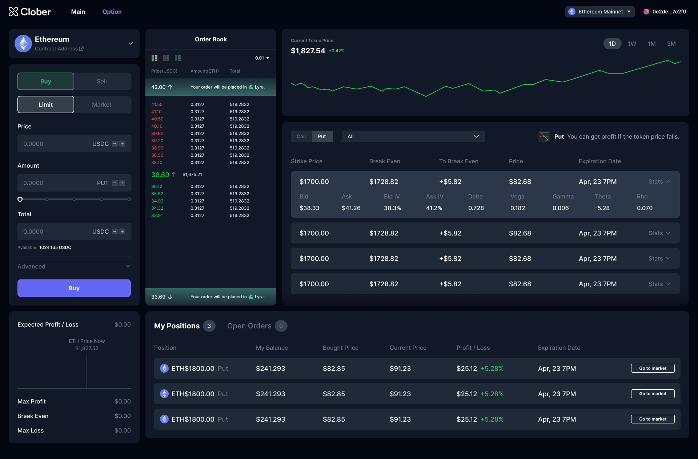

## Simple Summary
Endorse Clober's secondary markets for Lyra options which will enable users to trade options with tighter bid-ask spreads.

## Abstract
We are developing the front-end and smart contracts that integrates Lyra with Clober, providing secondary markets for Lyra options. This model reduces the bid-ask spread, improving profitability and user engagement. We seek Lyra's endorsement of this version, which will involve promoting our platform through Lyra's social channels and adding Clober to [Lyra's homepage apps section](https://www.lyra.finance/apps).

## Motivation
The current Lyra protocol uses an Automated Market Maker (AMM) model for trading options, leading to a significant bid-ask spread of approximately 20%. This model results in users facing an immediate loss upon opening a position. The lack of an external secondary market to trade Lyra options limit profitability and capital efficiency. By introducing limit order books, participants through price discovery can tighten the bid-ask spread making it both cheaper to open a position and more profitable to close a position.

## Specification
### Overview
Our version of Lyra integrates with Clober to enable on-chain limit orders and facilitate a secondary market for Lyra options. We request Lyra's endorsement of this version, which includes Lyra supporting our co-marketing efforts through their social channels and  adding Clober to [Lyra's homepage apps section](https://www.lyra.finance/apps).

### Rationale
Our decision to integrate with Clober arises from the need to improve Lyra's capital efficiency and user profitability. The current Lyra model has proven sub-optimal due to the substantial bid-ask spread. By integrating with Clober's on-chain order book, we believe we can reduce this spread, improving financial outcomes for users. We considered alternatives but found partnering with an established platform like Clober to be the most efficient and practical solution.

### Technical Specification
Our Lyra version, integrated with Clober, does not necessitate any changes to Lyra's existing public API or contracts. Lyra options are NFTs with the unique capability of merging and splitting, allowing us to wrap them into fungible ERC20 tokens. This transformation enables better market depth and liquidity, as ERC20 tokens are widely traded across DeFi platforms. We have created smart contracts to route Lyra option bids and asks to buy or sell these ERC20 tokens on our secondary markets. These contracts interact with Clober's order book, placing orders based on user requests. When liquidity is low on the secondary market, the contracts utilize Lyra's existing AMM model to fill orders.

The WIP smart contracts can be found [here](https://github.com/clober-dex/lyra-wrapper).

### Preview
While this version is not final, it will suffice to paint a picture of what such a product would look like.

## Copyright
Copyright and related rights waived via [CC0](https://creativecommons.org/publicdomain/zero/1.0/).
